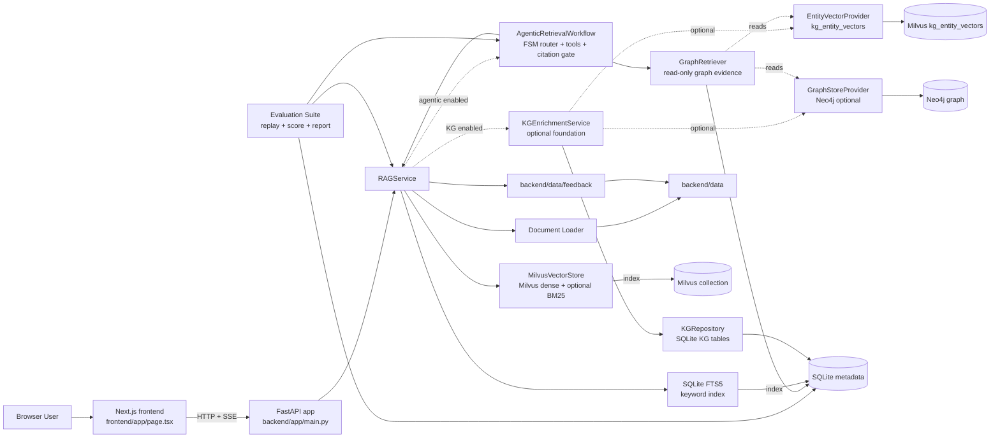
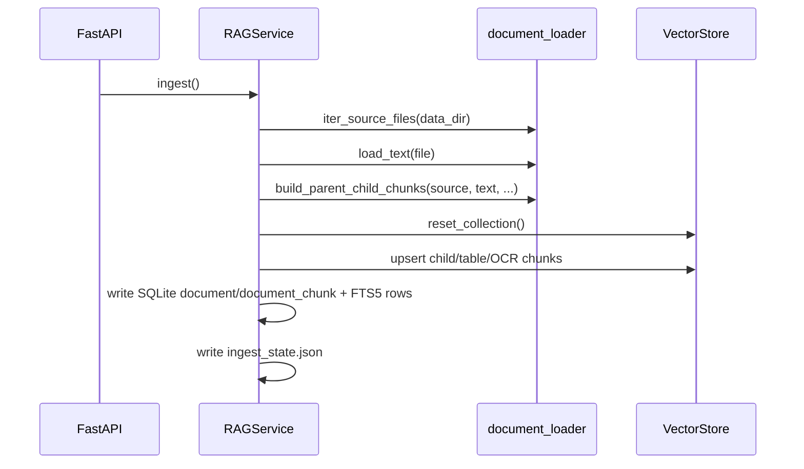
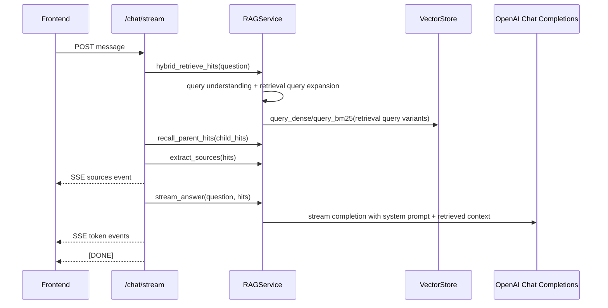

# Architecture

文档处理默认使用 parser registry 的 `builtin` 引擎，PDF 由 `pypdfium2` 逐页路由原生文本页和扫描页。`adaptive_chunker.py` 严格按 `heading -> heuristic -> legacy/recursive` 降级，`DocumentChunker` 在父块与子块层分别调用同一策略链。Docling 是延迟加载的可选引擎。

新 schema 不兼容旧版 SQLite、FTS5、Milvus、Neo4j 或媒体数据；切换时使用显式全库重置流程从空状态初始化。

## Overview

This repository is a two-tier RAG application:

- a Next.js frontend that renders a chat workspace plus dataset/document browsing
- a FastAPI backend that owns upload, parse, ingest, hybrid retrieval, streaming generation, and feedback persistence

The backend builds a `RAGService` at import time, configures OpenAI and the vector store from env vars, and may auto-ingest on startup when data changed or the index is empty. Evidence: `backend/app/main.py:53-99`.

## Topology



## Frontend Architecture

The frontend is a single client component page with local state for:

- active tab switching between model chat and dataset browser
- streaming assistant messages
- source list display
- feedback state per assistant message
- document preview modal
- dataset fetch state

This behavior lives almost entirely in `frontend/app/page.tsx:67-504`. Root HTML shell and metadata are defined in `frontend/app/layout.tsx:1-15`.

### Frontend request map

| UI capability | Endpoint | Client behavior |
|---|---|---|
| Dataset list | `GET /documents` | fetch on dataset tab open and on refresh button |
| Chat | `POST /chat/stream` | reads SSE chunks and appends sources then tokens |
| Document upload | `POST /documents/upload` | stores a supported document under backend data |
| Document parse | `POST /documents/parse` | previews parsed text and parent-child chunk counts |
| Text document preview | `GET /documents/content` | fetches raw parsed text for non-PDF files |
| PDF preview | `GET /documents/file` | embeds file URL in an iframe |
| Feedback write-back | `POST /feedback/answer` | submits corrected answer and refreshes dataset |

Evidence: `frontend/app/page.tsx:100-115`, `frontend/app/page.tsx:126-215`, `frontend/app/page.tsx:244-287`, `frontend/app/page.tsx:290-320`.

## Backend Architecture

The backend has Raw Evidence and optional Knowledge Graph foundation layers:

| Layer | Files | Responsibility |
|---|---|---|
| HTTP entrypoint | `backend/app/main.py` | env loading, app wiring, routes, startup behavior |
| Application service | `backend/app/services/rag_service.py` | ingest orchestration, retrieval filtering, context assembly, feedback persistence |
| Infrastructure helpers | `backend/app/services/vector_store.py`, `backend/app/services/document_loader.py`, `backend/app/services/query_understanding.py` | embeddings/vector DB, file parsing/chunking, pre-retrieval terminology expansion |
| KG foundation | `backend/app/services/kg_service.py`, `kg_repository.py`, `kg_extractor.py`, `entity_resolver.py`, `entity_vector_store.py`, `graph_store.py` | optional parent-chunk KG extraction, mention persistence, entity resolution, entity vector upsert, and evidence-bound graph writes |
| Graph retrieval | `backend/app/services/graph_retriever.py`, `backend/app/services/graph_store.py`, `backend/app/models/graph_retrieval.py` | read-only entity search, neighbor search, path search, and graph context building for later Agent tools |
| Agentic retrieval | `backend/app/services/query_router.py`, `retrieval_planner.py`, `agent_tools.py`, `agentic_workflow.py`, `citation_verifier.py`, `backend/app/models/agentic_retrieval.py` | optional finite-state workflow that routes questions, runs approved evidence tools, fuses evidence, verifies citations, and returns enterprise query fields |
| Evaluation suite | `backend/app/services/evaluation_*.py`, `backend/app/models/evaluation.py` | optional replay, scoring, storage, and reporting for curated enterprise RAG/GraphRAG/Agentic evaluation datasets |

### Core Processing Runtime

The current Weknora-aligned runtime keeps FastAPI and SQLite/Milvus, but separates durable orchestration from processing work:

- upload confirmation writes durable task records when `PROCESSING_WORKER_ENABLED=true`
- `DocumentProcessingWorker` claims runnable tasks, maintains leases, retries failures, and records dead-letter rows
- `ProcessingSpanTracker` records root/stage/subspan/generation spans in SQLite; the frontend Trace drawer reads this span tree first
- local trace files under `PROCESSING_TRACE_DIR` remain supplemental evidence for parsed markdown, chunk previews, reports, and traceback files
- prompt composition is centralized through YAML files in `backend/config/prompt_templates/`
- retrieval quality controls include low-recall expansion, rerank degradation, MMR, duplicate removal, and structured debug metadata
- optional extended agent tools are disabled unless explicitly configured and return stable unavailable observations when unsafe or unavailable

### Backend route map

| Route | Method | Purpose |
|---|---|---|
| `/health` | `GET` | simple health probe |
| `/ingest` | `POST` | full reindex of current source files |
| `/chat/stream` | `POST` | retrieval + streaming completion via SSE |
| `/documents/upload` | `POST` | stores an uploaded supported document under `data/uploads` |
| `/documents/parse` | `POST` | parses a source file and returns preview plus parent-child counts |
| `/documents/content` | `GET` | parsed text for a source file |
| `/documents/file` | `GET` | raw file download/preview |
| `/documents` | `GET` | dataset listing with size, update time, and chunk count |
| `/feedback/answer` | `POST` | stores corrected answer as markdown and upserts it |

Evidence: `backend/app/main.py:102-178`.

## Ingest and Retrieval Flow



Key details:

- source files are discovered recursively under `data_dir`, excluding temporary Office lock files, and are limited to configured extensions. Evidence: `backend/app/services/document_loader.py:16-21`.
- ingest rebuilds the collection from scratch before upserting new child chunks. Evidence: `backend/app/services/rag_service.py`, `backend/app/services/vector_store.py:47-64`.
- PDF files take a different chunking path that first preserves markdown header structure. Evidence: `backend/app/services/document_loader.py:99-119`, `backend/app/services/document_loader.py:139-174`.
- retrieval combines Milvus dense hits with Milvus BM25 when enabled or SQLite FTS5 keyword hits when BM25 is disabled, then recalls parent chunks for answer context. Evidence: `backend/app/services/rag_service.py`, `backend/app/services/document_repository.py`.

## Streaming Answer Flow



Evidence: `backend/app/main.py:113-133`, `backend/app/services/rag_service.py:276-300`, `frontend/app/page.tsx:136-204`.

## Feedback Learning Loop

When a user marks an answer as incorrect and submits a correction:

1. the frontend finds the paired user question from message history
2. the backend generates a short title
3. the backend writes a markdown file into `backend/data/feedback/`
4. the backend chunks that markdown and upserts it into the vector store
5. the frontend refreshes the dataset list

Evidence: `frontend/app/page.tsx:221-287`, `backend/app/services/rag_service.py:207-274`.

## Storage Layout

| Path | Role |
|---|---|
| `backend/data/` | canonical source corpus used for ingest |
| `backend/data/uploads/` | uploaded user documents that join the corpus |
| `backend/data/feedback/` | generated correction documents that join the corpus |
| `backend/chroma_db/` | persisted Chroma index currently present in workspace |
| active metadata DB `document` / `document_chunk` | durable document and raw chunk evidence metadata |
| active metadata DB `document_chunk_fts` | SQLite FTS5 keyword index derived from child/table/OCR chunks |
| active metadata DB `document_processing_task` | durable upload/document processing task lifecycle, lease, retry, and last-error state |
| active metadata DB `document_processing_dead_letter` | exhausted processing tasks with final error details and payload snapshots |
| active metadata DB `knowledge_processing_spans` | database trace tree for processing attempts, stages, subspans, and generation spans |
| active metadata DB `kg_extraction_task` | optional KG extraction task lifecycle and failure state |
| active metadata DB `entity_mention` | optional entity mentions bound back to document chunks |
| active metadata DB `graph_community_summary` | placeholder storage for later graph summary features |
| active metadata DB `eval_run` / `eval_result` | optional enterprise evaluation runs and per-case snapshots |
| `backend/evalsets/` | sample evaluation datasets, kept separate from the retrievable corpus |
| `backend/.env` | local runtime configuration |

Note: code defaults `VECTOR_STORE_DIR` to `./vector_db`, while the current workspace also contains `backend/chroma_db/`. The active persistence directory therefore depends on env configuration. Evidence: `backend/app/main.py:61-66`.

## Dependency Highlights

- Backend packages include FastAPI, OpenAI, ChromaDB, Python DOCX parsing, Excel parsing, multipart upload support, and PDF tooling. Evidence: `backend/requirements.txt`.
- Frontend packages include Next 15, React 19, `react-markdown`, and `remark-gfm`. Evidence: `frontend/package.json:5-23`.

## Extension Points

- Add new parsers in `document_loader.py` when supporting a new corpus format.
- Adjust ranking thresholds and chunking in `RAGService` for retrieval tuning.
- Refactor `frontend/app/page.tsx` into components if the UI grows, but preserve the existing endpoint contracts unless backend changes with it.

## Enterprise Evaluation Suite

The evaluation suite sits above production query paths. It loads versioned JSON/YAML evalsets from configured evaluation directories, executes cases through `RAGService.answer_query()`, records answer snapshots, scores deterministic metrics, and writes JSON/Markdown reports. It reuses `CitationVerifier` and `DocumentRepository` to verify citations and graph `source_chunk_id` traceability.

Evaluation data is not ingested into the knowledge corpus, does not write feedback documents, and does not mutate chat memory, vector stores, or graph data. `/eval/runs` exposes run creation and inspection for operators; the user-facing `/rag/query` and `/chat/stream` routes keep their existing behavior.

## Knowledge Graph Foundation

KG enrichment is present but default-disabled. When `KG_EXTRACTION_ENABLED=true`, `RAGService` invokes `KGEnrichmentService` after document parsing, parent-child chunk persistence, Milvus chunk upsert, and SQLite FTS5 indexing have completed.

The provider boundaries are:

- `KGExtractorProvider`: extracts entities and relations from parent chunks.
- `EntityResolverProvider`: canonicalizes extracted entities through exact-name, alias, and optional vector-similarity matching.
- `EntityVectorProvider`: writes and searches entity embeddings in the Milvus `kg_entity_vectors` collection.
- `GraphStoreProvider`: writes canonical entities and evidence-bound relations to a graph backend.

The default graph implementation is `Neo4jGraphStore`, which imports the Neo4j driver lazily. If graph storage is disabled, backend startup does not need Neo4j. If graph storage is enabled but Neo4j dependencies are unavailable, startup still succeeds and KG tasks fail or partial-fail without breaking Raw RAG ingest.

Every graph relation is bound to source evidence through `source_chunk_id`, `doc_id`, `page_start`, `page_end`, `extractor_version`, `confidence`, and `created_at`. This change only writes the graph foundation; `/rag/query` and `/chat/stream` continue to use Raw Evidence retrieval by default, and `used_entities` / `graph_paths` remain empty until a later GraphRetriever change.

## GraphRetriever

`GraphRetriever` is a read-only graph evidence tool. It can search entities, retrieve neighbors, find bounded paths, and build structured graph context for a later Agent workflow. It does not generate final answers and does not replace Raw RAG retrieval.

The read-side provider boundary is `GraphQueryProvider`. `Neo4jGraphStore` implements this read contract in addition to its write-side `GraphStoreProvider` behavior, while preserving lazy optional Neo4j imports. GraphRetriever can also use `EntityVectorProvider` for optional semantic entity matching.

Graph results are derived evidence. Returned relations and paths must carry `source_chunk_id`, and those chunk ids are validated through SQLite `document_chunk` before graph evidence is considered usable. Relations whose source chunks are missing are excluded and surfaced in debug metadata.

`GRAPH_RETRIEVER_ENABLED=false` by default. When disabled, backend startup does not require Neo4j. `/rag/query` and `/chat/stream` continue to use Raw Evidence retrieval by default; GraphRetriever is intended to become an Agent-callable tool in a later workflow change.

## Agentic Retrieval Layer

Agentic retrieval is present but default-disabled through `AGENTIC_RETRIEVAL_ENABLED=false`. When enabled for `/rag/query`, `RAGService.answer_query()` delegates to a finite-state workflow instead of the direct Raw RAG path:

```text
START
  -> AnalyzeQuestion
  -> PlanRetrieval
  -> CheckPermissionScope
  -> RunRetrieval
  -> FuseEvidence
  -> RerankEvidence
  -> NeedMoreEvidence
  -> BuildContext
  -> GenerateAnswer
  -> VerifyCitations
  -> ReturnAnswer
END
```

The workflow is not a free-form Agent. `QueryRouter` classifies questions as `fact`, `source`, `howto`, `troubleshooting`, `comparison`, `impact`, `dependency`, `summary`, or `decision`; `RetrievalPlanner` maps that route to approved tools only: `RawRAGTool`, `KeywordSearchTool`, and `GraphRetrieverTool`. Tool calls happen only in `RunRetrieval`.

`CitationVerifier` checks answer citations, used chunks, and graph path relation source chunks through `document_chunk` lookup before factual answers are returned. If required graph evidence or citation verification is missing, the workflow returns an explicit insufficient-evidence answer. `/rag/query` keeps existing fields and adds `agent_trace`, `tool_calls`, and `evidence_summary`.

`/chat/stream` can also use the Agentic Retrieval workflow when `CHAT_AGENTIC_WORKFLOW_ENABLED=true`. In that mode the backend streams FSM progress as SSE before answer tokens: `agent_trace`, `tool_call`, `tool_observation`, `evidence_summary`, and `citation_verification`. Existing chat events remain compatible: `conversation_id`, `sources`, `reasoning`, `token`, `memory_updated`, and `[DONE]`.

## Milvus And Docling Update

The current target architecture replaces Chroma as the active vector store:

- SQLite owns business data in two tables: `document` and `document_chunk`.
- SQLite also owns `document_chunk_fts`, a derived FTS5 index for exact keyword retrieval when Milvus BM25 is disabled.
- Milvus owns child/table/OCR dense vectors, optional BM25 sparse text, and filter metadata in `rag_chunk_vectors`.
- `DocumentParser` normalizes files into `ParsedDocument` and `ParsedElement`; PDF and DOCX use Docling first.
- `DocumentChunker` creates parent chunks for context and child/table/OCR chunks for dense and BM25 retrieval.
- Table chunks are preserved as whole structures. Their embedding text uses title path, caption, nearby text, generated summary, fields, rows, and Markdown; LLM context uses the original Markdown/HTML table plus nearby explanation.
- `RAGService.hybrid_retrieve_hits` performs query understanding, dense fan-out, keyword fan-out through Milvus BM25 or SQLite FTS5, RRF fusion, chunk-id dedupe, optional local-first reranking, and parent recall.
- Raw retrieval boundaries are exposed through provider protocols for vector index access, keyword search, and evidence lookup so future GraphRAG and Agent tools can call the Raw Evidence Layer without binding to one backend.
- `backend/app/services/reranker.py` keeps reranking default-disabled and falls back to NoOp when local model dependencies are unavailable.
- `EmbeddingProvider` abstracts embedding calls so OpenAI-compatible embeddings can later be swapped for bge-m3, Qwen embeddings, or local models.

`backend/chroma_db/` is legacy persisted data. Do not edit or delete it unless cleanup is explicitly requested.

## Conversation And Long-Term Memory

The chat flow now has memory layers that are separate from the document corpus:

- `/chat/stream` accepts optional `conversation_id`, `memory_enabled`, and `temporary` fields.
- The backend emits `conversation_id` before sources, keeps the existing `sources`, `reasoning`, `token`, and `[DONE]` SSE events, and may emit `memory_updated` before completion.
- `ConversationRepository` stores conversations and messages in SQLite.
- `ConversationService` selects a bounded recent-message window and maintains rolling summaries.
- `MemoryRepository` stores durable user/project memories with scope, type, normalized key, confidence, status, and source IDs.
- `MemoryService` recalls active memories, formats prompt context, conservatively extracts memory candidates, merges duplicates, and deletes memories.
- `GET /memories` lists active memories, and `DELETE /memories/{memory_id}` excludes a memory from future prompt assembly.
- Document ingest/reindex does not list, delete, or rewrite long-term memories.

Prompt assembly keeps memory labels distinct from source evidence:

```text
system prompt
  -> long-term memory context
  -> conversation summary and recent turns
  -> retrieved RAG document context
  -> current question
```

## Multi-Knowledge-Base Domain

`workspace` 是轻量顶层容器，第一阶段每个 `knowledge_base` 都是 `document` 类型。SQLite 是 workspace、KB、document、chunk 和 enrichment 状态的事实源；Milvus、FTS5、实体向量和 Neo4j 是可重建派生索引。

请求在 HTTP 边界解析一次 `KnowledgeBaseScope`：

```text
HTTP knowledge_base_id(s)
  -> KnowledgeBaseService.resolve_scope
  -> RAGService / Agent tools / GraphRetriever / Evaluation
  -> SQLite + Milvus + FTS5 + Neo4j scope filters
  -> CitationVerifier scoped source_chunk lookup
```

未传范围只解析到稳定默认 KB。显式多库查询在所选 KB 中 fan-out，并用 `(knowledge_base_id, chunk_id)` 去重。归档 KB 保留物理数据，但不能上传或检索。

上传基础路径完成后，`DocumentEnrichmentService` 独立生成概要、关键词和建议问题。状态为 `none -> pending -> processing -> completed|failed`；失败不改变文档 `parsed` 状态。概要只用于目录导航、建议问题和可选召回增强，答案引用必须回查原始 chunk。

SQLite 只接受空库或唯一最终 schema 版本。发现历史表、未知版本或旧 Milvus collection 时，系统报告 `reset_required`，不会执行 `ALTER`、回填或请求期降级迁移。部署升级通过仅限 CLI 的 `KnowledgeStorageResetCoordinator` 编排 SQLite、Milvus、可选 Neo4j、评测报告、ingest 状态和受管理源文件：

```text
stop all writers
  -> dry-run deletion plan
  -> exact confirmation + optional backup
  -> maintenance marker + reset manifest
  -> provider reset
  -> final schema/index initialization
  -> default workspace/Document KB
  -> clear maintenance only after all providers succeed
```

`query_log` 和 `answer_feedback` 保存实际 workspace/KB scope、工具、引用 chunk 和结果状态。会话与长期记忆仍不是知识证据，不能绕过 scope 或 citation 校验。
